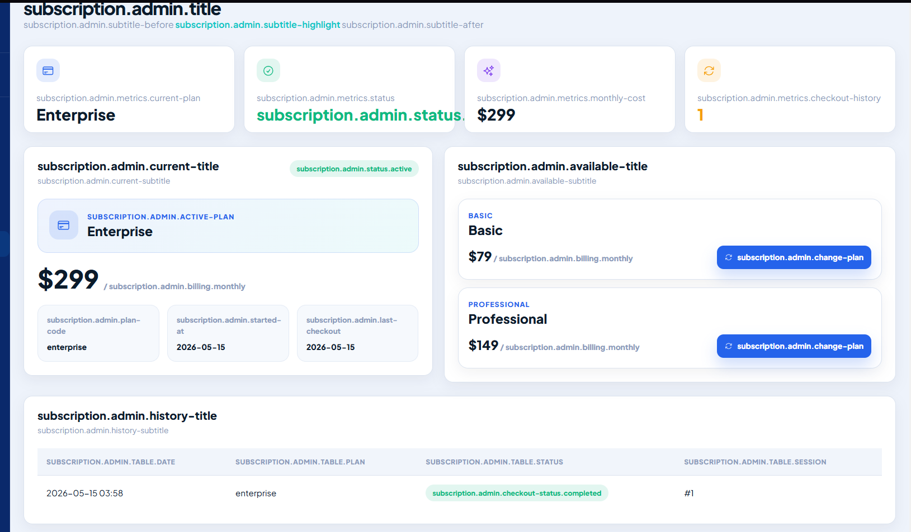

### UX Heuristics & Principles Evaluation

#### Tabla resumen de problemas encontrados

| # | Problema | Escala de severidad | Heurística / Principio violado |
|---|---|---:|---|
| 1 | La tabla comparativa de planes es demasiado extensa y puede hacer que el usuario pierda de vista a qué plan corresponde cada columna. | 2 | Usability: Recognition rather than recall / Information Architecture: Is it usable? |
| 2 | El módulo de suscripción muestra claves internas de internacionalización cuando la aplicación está configurada en español. | 3 | Usability: Consistency and standards / Inclusive Design: Provide comparable experiences / Information Architecture: Is it understandable? |
| 3 | Los formularios presentan validaciones insuficientes y un manejo de errores poco robusto. | 2 | Usability: Error prevention / Usability: Help users recognize, diagnose, and recover from errors / Information Architecture: Is it usable? |

---

#### Problema #1: La tabla comparativa de planes es demasiado extensa

**Severidad:** 2  
**Heurística violada:** Usability: Recognition rather than recall / Information Architecture: Is it usable?

**Problema:**  
La tabla comparativa de planes presenta una gran cantidad de características distribuidas en varias secciones. Debido a su extensión vertical, el usuario puede perder de vista el encabezado y olvidar qué plan corresponde a cada columna mientras revisa la información ubicada en la parte inferior.

Esto incrementa el esfuerzo cognitivo, ya que el usuario debe recordar constantemente la posición de los planes Basic, Professional y Enterprise para interpretar correctamente cada característica.

**Recomendación:**  
Mantener fijo el encabezado de los planes durante el desplazamiento vertical. También se recomienda resaltar visualmente la columna seleccionada o dividir la comparación en categorías plegables para reducir la cantidad de información mostrada simultáneamente.

---

#### Problema #2: Traducción incompleta en el módulo de suscripción

**Severidad:** 3  
**Heurística violada:** Usability: Consistency and standards / Inclusive Design: Provide comparable experiences / Information Architecture: Is it understandable?

**Problema:**  
Al cambiar la aplicación al idioma español, el módulo de suscripción muestra directamente claves internas de internacionalización en lugar de textos comprensibles para el usuario.

Entre las claves visibles se encuentran:

- `subscription.admin.title`
- `subscription.admin.metrics.current-plan`
- `subscription.admin.status.active`
- `subscription.admin.change-plan`
- `subscription.admin.table.date`

En la versión en inglés, la información se muestra correctamente. Por ello, los usuarios que utilizan el idioma español reciben una experiencia inferior e inconsistente.

El problema afecta información importante como:

- Plan actual.
- Estado de la suscripción.
- Costo mensual.
- Cambio de plan.
- Historial de pagos.

Las claves técnicas no permiten que el usuario comprenda fácilmente el propósito de cada elemento de la interfaz.

**Evidencia:**

**Recomendación:**  
Completar las claves faltantes en el archivo de traducción en español y comprobar que coincidan exactamente con las claves utilizadas por los componentes.

También se recomienda configurar un idioma de respaldo para que, cuando una traducción no esté disponible, se muestre el texto en inglés en lugar de la clave interna.

---

#### Problema #3: Validaciones insuficientes y manejo de errores poco robusto

**Severidad:** 2  
**Heurística violada:** Usability: Error prevention / Usability: Help users recognize, diagnose, and recover from errors / Information Architecture: Is it usable?

**Principio de seguridad relacionado:** Validación y saneamiento de entradas / Integridad de los datos.

**Problema:**  
Durante los flujos de registro y uso de formularios, la aplicación acepta una amplia variedad de datos sin validar suficientemente su formato, longitud o coherencia.

La validación más visible se concentra principalmente en el campo de correo electrónico, por ejemplo, solicitando la presencia del carácter `@`. Sin embargo, otros campos permiten introducir información con pocas restricciones.

Este comportamiento puede generar registros incorrectos, inconsistentes o poco confiables. Aunque no bloquea directamente el flujo, reduce la calidad de los datos almacenados y la confiabilidad general de la aplicación.

**Recomendación:**  
Aplicar validaciones tanto en el frontend como en el backend. Se recomienda incluir:

- Longitud mínima y máxima.
- Restricciones específicas para números, fechas y textos.
- Mensajes claros junto al campo que presenta el error.
- Saneamiento de entradas.
- Validación del lado servidor, incluso si el frontend ya realiza validaciones.
- Bloqueo del envío mientras los datos no cumplan con las condiciones establecidas.
